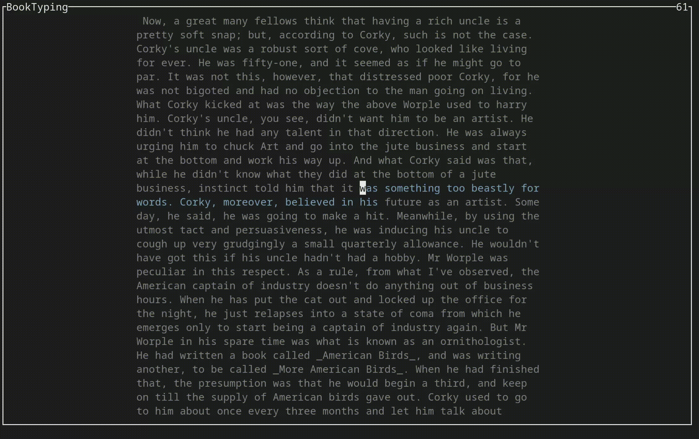

# booktyping

[](https://crates.io/crates/booktyping)
[](https://docs.rs/booktyping)
[](https://github.com/valeratrades/booktyping/actions?query=branch%3Amaster) <!--NB: Won't find it if repo is private-->
[](https://github.com/valeratrades/booktyping/tree/master/src)



`booktyping` is a simple commandline tool for practicing typing accuracy while reading a book.

## Installation

`booktyping` has only been tested on linux, but should work on Windows and MacOS. The only dependency is rust. 

```
cargo install booktyping
```

## Usage
Find a text copy of your favorite book, and place it in $HOME/.booktyping/{book_title}.txt.
Now run terminal version of booktyping with 
```sh
booktyping run [OPTIONS] {book_title}
```

Your progress will be automatically saved, and JSON logs of your keypresses and your sample completions will be saved in $HOME/.booktyping/{book_title}/keypresses.json and $HOME/.booktyping/{book_title}/tests.json respectively.


<br>

#### License

<sup>
Licensed under either of <a href="LICENSE-APACHE">Apache License, Version
2.0</a> or <a href="LICENSE-MIT">MIT license</a> at your option.
</sup>

<br>

<sub>
Unless you explicitly state otherwise, any contribution intentionally submitted
for inclusion in this crate by you, as defined in the Apache-2.0 license, shall
be dual licensed as above, without any additional terms or conditions.
</sub>
